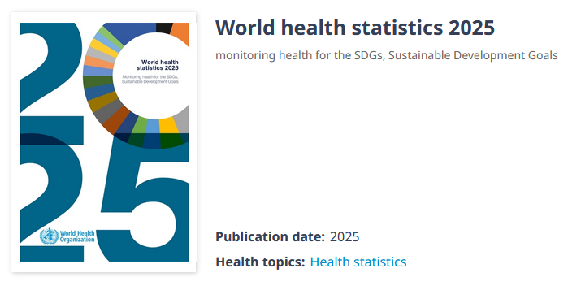

# 1. Introdução e Escolha da Base de Dados

A base de dados utilizada neste trabalho tem origem no dataset Life Expectancy (WHO) - 2025, obtido no [Kaggle](https://www.kaggle.com/datasets/khunglongg/life-expectancy-who-2025), baseado em um relatório publicado pela própria **World Health Organization (WHO)**



Motivo da Escolha: Fiz questão de, neste trabalho, buscar uma base de dados real e que nos permitisse insights interessantes e relevantes para a atualidade. Experiências anteriores com bases sintéticas mostraram que nem sempre é possível este tipo de análise quando os dados não são reais. Desta forma, este dataset foi selecionado por apresentar uma estrutura rica para análise, atendendo os requisitos do projeto por possuir mais de 4 variáveis numéricas de interesse e presença de dados faltantes, permitindo a prática de técnicas de imputação.

Resultados Esperados: Espera-se identificar quais fatores possuem maior correlação com a expectativa de vida e verificar como essas variáveis se distribuem através dos países, além de tratar as lacunas nos dados para garantir uma análise robusta. A análise visa fornecer insights sobre os determinantes da expectativa de vida.

# 2. Importação das bibliotecas e preparação dos dados

```{r}
# Carregamento de bibliotecas
library(tidyverse)   
library(summarytools) 
library(ggpubr)       
library(mice)         
library(gtsummary)    
library(corrplot)    

# Leitura dos dados do arquivo CSV 
df <- read.csv("data/Life_expectancy_2025.csv")

# Padronizando nomes de colunas (substituindo espaços por underscores)
names(df) <- make.names(names(df))

str(df)
summary(df)

```

Em especial, pretendo focar em variáveis estruturais gerais, e não diretamente relacionadas à "tempo de vida", desta forma, variáveis como infant.deaths, adult.mortality, thinness.1.19.years e as doenças individualmente não vão ser analisádas neste relatório.

# 3. Análise Univariada: Descrição Estatística

```{r}
# Selecionando variáveis de interesse para a análise
vars_interesse <- df %>% 
  select(
    Life.expectancy,
    Alcohol,
    percentage.expenditure,
    BMI,
    Total.expenditure,
    GDP,
    Population,
    Income.composition.of.resources,
    Schooling
  )

# Descrição estatística usando summarytools::descr
descr(vars_interesse)

# Tabela descritiva formatada
tbl_summary(vars_interesse) %>% 
  add_n() %>% 
  modify_header(label = "**Variável**") %>% 
  modify_spanning_header(c(stat_0) ~ "**Estatísticas Descritivas**")

```

A partir destes dados podemos que a nossa base é altamente heterogênea, com a expectativa de vida variando de 46 até 82 anos (com desvio padrão de 9). Outra variável que chama especialmente a atenção é o GDP (PIB), que vai desde 136 até 57362, possuindo uma média de 7761 e desvio padrão de 11375. População também possui variações bastante significativas como essas.

# 4. Análise Bivariada: Correlação e Matriz de Espalhamento

Com esta análise buscamos observar a relação entre pares de variáveis, para identificar padrões de correlações no nosso dataset.

```{r}
# Criando a matriz de espalhamento para as variáveis de interesse
pairs(
  vars_interesse,
  main = "Matriz de Espalhamento das Variáveis de Interesse",
  pch = 35,
  cex = 0.1,
  col = rgb(0, 0, 1, 0.25),
  cex.labels = 0.8,
  lower.panel = panel.smooth
)

# Calculando a matriz de correlação
cor_matrix <- cor(vars_interesse, use = "pairwise.complete.obs")
print(round(cor_matrix, 2))

# Visualizando a matriz de correlação com corrplot
corrplot(
  cor_matrix,
  method = "color",
  type = "upper",
  tl.col = "black",
  tl.srt = 45,
  tl.cex = 0.7,
  addCoef.col = "black",
  number.cex = 0.5
)

```

Apesar do número de variáveis dificultar um pouco a avaliação visual da matriz de espalhamento, é possível identificar que algumas variáveis apresentam associação positiva mais forte com a expectativa de vida. Os casos mais evidentes são BMI, Income.composition.of.resources e Schooling, que também aparecem com os maiores coeficientes de correlação positiva na matriz de correlação. Em especial, Income.composition.of.resources e Schooling se destacam por apresentarem relações quase lineares com a expectativa de vida. Já variáveis como GDP e percentage.expenditure também apresentam correlação positiva moderada, mas, pela matriz de espalhamento, essa relação parece menos uniforme e mais influenciada pelos países com valores mais elevados. Por outro lado, Population praticamente não apresenta associação com a expectativa de vida, enquanto Total.expenditure mostra apenas uma relação fraca. Assim, os resultados sugerem que fatores ligados ao desenvolvimento humano e à educação parecem estar mais fortemente associados à expectativa de vida do que variáveis econômicas isoladas ou o tamanho da população.

# 5. Normalidade das Variáveis

Nesta etapa analisaremos a distribuição individual de cada variável, com o objetivo de verificar se elas apresentam comportamento próximo de uma distribuição normal. A distribuição normal, também chamada de Gaussiana, é uma distribuição contínua e simétrica em torno da média, na qual aproximadamente 68% dos valores se encontram dentro de um desvio padrão da média, e 95% dentro de dois desvios padrão. Devido ao seu formato característico em forma de sino, ela também é conhecida como *bell curve*.

Para essa análise serão utilizados histogramas, que permitem observar visualmente o formato da distribuição dos dados e identificar possíveis assimetrias ou caudas mais longas em uma das extremidades. Além disso, utilizaremos Q-Q plots, que comparam os quantis observados nos dados com os quantis esperados de uma distribuição normal, permitindo avaliar visualmente o quanto cada variável se aproxima desse padrão.

```{r}
# Loop para gerar histogramas e Q-Q plots
for (var in names(vars_interesse)) {
  
  # Histograma
  p1 <- ggplot(vars_interesse, aes_string(x = var)) +
    geom_histogram(aes(y = after_stat(density)),
                   bins = 30,
                   fill = "skyblue",
                   color = "black") +
    geom_density(color = "red", linewidth = 1, na.rm = TRUE) +
    labs(title = paste("Histograma de", var),
         x = var,
         y = "Densidade") +
    theme_minimal()
  print(p1)
  
  # Q-Q Plot
  p2 <- ggqqplot(vars_interesse,
                 x = var,
                 title = paste("Q-Q Plot de", var),
                 xlab = "Quantis Teóricos",
                 ylab = "Quantis da Amostra")
  print(p2)
}
```

### 

## Análise da Normalidade das Variáveis

A normalidade das variáveis foi avaliada por meio da inspeção visual dos histogramas com curva de densidade e dos Q-Q plots. Os histogramas permitem observar o formato geral da distribuição dos dados, enquanto os Q-Q plots comparam os quantis observados com os quantis esperados de uma distribuição normal. Quando os pontos seguem aproximadamente a linha de referência no Q-Q plot, há evidência de comportamento próximo à normalidade; desvios sistemáticos indicam afastamentos dessa distribuição.

### Life.expectancy

O histograma da variável Life.expectancy mostra maior concentração de valores na faixa entre aproximadamente 70 e 75 anos, com menor frequência de valores mais baixos. A distribuição é pouco simetrica, com uma calda maior à esquerda, indicando que poucos países possuem expectativa de vida significativamente menor que a maioria. No Q-Q plot, os pontos acompanham relativamente bem a linha de referência na região central, mas há desvios nas extremidades. Isso indica que a variável apresenta aproximação à normalidade no centro da distribuição, porém com desvios nas caudas.

### Alcohol

A variável Alcohol apresenta também uma assimetria O histograma mostra maior concentração de observações em níveis mais baixos de consumo de álcool, indicando muitos países onde não há quase nenhum consumo, com alguns valores mais elevados formando uma cauda à direita. No Q-Q plot, novamente os pontos seguem a linha de referência na região central, mas apresentam desvios nos quantis inferiores e superiores.

### percentage.expenditure

O histograma da variável percentage.expenditure revela até aqui a maior assimetria. A maior parte dos países apresenta valores relativamente baixos de gasto percentual, enquanto poucos países possuem valores extremamente elevados, produzindo uma longa cauda. O Q-Q plot confirma esse comportamento, com grande afastamento dos pontos da linha de referência nos quantis superiores. Essa variável apresenta clara violação da normalidade.

### BMI

A variável BMI apresenta uma distribuição bimodal, com dois picos visíveis no histograma. Isso indica a presença de dois grupos distintos de países com níveis diferentes de índice de massa corporal médio, uns com índice por volta de 20 e outros por volta de 55. No Q-Q plot, observa-se que os pontos se afastam da linha de referência em várias regiões da distribuição, refletindo esse comportamento multimodal. Portanto, a variável não segue uma distribuição normal.

### Total.expenditure

O histograma da variável Total.expenditure apresenta distribuição relativamente concentrada em torno de valores intermediários, com leve assimetria positiva. No Q-Q plot, os pontos seguem a linha de referência na região central, se mantendo dentro da faixa cinza exceto nos valores muito mais altos. Dessa forma, apenas os outliers extremos impedem que a variável seja considerada normal.

### GDP

A variável GDP apresenta forte assimetria positiva, característica comum em indicadores econômicos globais. O histograma mostra grande concentração de países com valores mais baixos de PIB per capita e poucos países com valores muito elevados, gerando uma longa cauda à direita. No Q-Q plot, os pontos se afastam significativamente da linha de referência, especialmente nos quantis superiores, indicando claro desvio da normalidade.

### Population

A variável Population apresenta assimetria positiva extrema, puxado por países super populosos como China e Índia. O histograma mostra que a maioria dos países possui populações relativamente menores, enquanto poucos países apresentam populações extremamente elevadas, produzindo uma cauda muito longa à direita. O Q-Q plot evidencia forte desvio da linha de referência em grande parte da distribuição, indicando que a variável está bastante distante de um comportamento normal.

### Income.composition.of.resources

O histograma da variável Income.composition.of.resources apresenta distribuição relativamente concentrada em valores intermediários, com leve assimetria e dois picos. A maior parte das observações encontra-se em uma faixa relativamente estreita da escala. No Q-Q plot, os pontos seguem relativamente próximos da linha de referência na região central, com pequenos desvios nas extremidades. Isso indica uma distribuição relativamente equilibrada, ainda que não perfeitamente normal, com uma influência bimodal

### Schooling

A variável Schooling apresenta um histograma com formato relativamente próximo ao de uma distribuição simétrica, com concentração maior de valores na região central. No Q-Q plot, os pontos acompanham razoavelmente bem a linha de referência na maior parte da distribuição, com pequenos desvios nas extremidades. Dessa forma, a variável apresenta comportamento relativamente próximo da normalidade quando comparada às demais variáveis analisadas.

### Síntese Geral

De modo geral, observa-se que variáveis relacionadas à escala econômica ou tamanho dos países, como GDP, Population e percentage.expenditure, apresentam forte assimetria positiva, refletindo a desigualdade entre países onde alguns poucos países possuem números muito distantes da maioria. Já variáveis associadas a desenvolvimento humano, como Life.expectancy, Schooling e Income.composition.of.resources, apresentam distribuições mais equilibradas e próximas de um comportamento aproximadamente normz'al, ainda que com alguns desvios nas extremidades.

```{r}
# Aplicando o teste de Shapiro-Wilk para as variáveis de interesse

shapiro_results <- list()

for (var in names(vars_interesse)) {
  # Remove NAs antes de testar
  data_for_test <- na.omit(vars_interesse[[var]])
  
  if (length(data_for_test) > 3 && length(data_for_test) <= 5000) {
    shapiro_results[[var]] <- shapiro.test(data_for_test)
  } else if (length(data_for_test) > 5000) {
    # Amostra para o teste se o dataset for muito grande
    sample_data <- sample(data_for_test, 5000)
    shapiro_results[[var]] <- shapiro.test(sample_data)
    warning(paste("Shapiro-Wilk aplicado a uma amostra de 5000 para", var, "devido ao tamanho do dataset."))
  } else {
    shapiro_results[[var]] <- "Não foi possível aplicar Shapiro-Wilk (dados insuficientes ou muitos NAs)."
  }
}

# Exibindo os resultados
shapiro_results
```

### Teste de Normalidade (Shapiro-Wilk)

Para complementar a análise visual realizada por meio dos histogramas e Q-Q plots, foi aplicado o teste de Shapiro-Wilk para avaliar estatisticamente a normalidade das variáveis. Nesse teste, a hipótese nula (H₀) assume que os dados seguem uma distribuição normal. Assim, p-valores menores que 0,05 indicam rejeição da hipótese de normalidade.

Os resultados obtidos mostram que todas as variáveis apresentam p-valores inferiores a 0,05, indicando rejeição da hipótese de normalidade para todas elas.

Esse resultado confirma, em grande parte, as evidências observadas na análise gráfica. Variáveis como percentage.expenditure, GDP e Population apresentaram valores muito baixos do estatístico W e p-valores extremamente pequenos, reforçando a forte assimetria observada nos histogramas e Q-Q plots. Essas variáveis possuem distribuições altamente concentradas em valores menores, com caudas longas à direita, o que as afasta significativamente de uma distribuição normal.

Por outro lado, variáveis como Life.expectancy, BMI, Income.composition.of.resources e Schooling apresentaram valores do estatístico W mais próximos de 1, sugerindo distribuições relativamente mais próximas da normalidade. Ainda assim, os p-valores indicam que essas variáveis também não seguem perfeitamente uma distribuição normal, o que já era sugerido pelos pequenos desvios observados nas caudas dos Q-Q plots.

De modo geral, os resultados do teste de Shapiro-Wilk confirmam a análise visual realizada anteriormente, indicando que, embora algumas variáveis apresentem comportamento aproximadamente simétrico na região central da distribuição, nenhuma delas segue estritamente uma distribuição normal.

# 6. Qualidade de Dados: Completude e Imputação

Antes de avançar para outras análises, é importante avaliar a qualidade dos dados, e um dos aspectos mais básicos disso é a completude.

**Em suas palavras, como é definido completude?**

Completude é o quão integros estão os dados de uma base, sem valores faltantes sejam por erros de medição ou processamento, de forma que cada linha do nosso dataset possua todas as variáveis devidamente indicadas em suas colunas, sem dados faltantes ou incoerentes (tipo diferente de dado)

**Qual o impacto em uma análise exploratória de dados?**

Dados incompletos podem afetar bastante uma análise exploratória de dados, pois nem sempre é possível identificar a natureza destes dados faltantes, ou o fenômeno que causou essas lacunas. Ou seja, caso os dados faltantes possuam algum tipo de viés, como erro em um equipamento de medição quando os dados são muito altos, é possível que nossa análise possua um viés.

Ademais, ainda que estes dados ocorram de forma aleatória, cada dado faltante é uma informação a menos que o nosso dataset possui, diminuindo portando a sua qualidade e aplicabilidade para analisar o fenômeno de interesse. Ao perdermos uma quantia como 20% dos dados por conta de dados faltantes, podemos deixar de obter insights valiosos na nossa análise.

Por fim, os modelos matemáticos estatísticos, gráficos e de machine learning por vezes não conseguem lidar com dados incompletos, de forma que é necessário etapas adicionais de processamento dos dados para viabilizar este tipo de análise, que perde um pouco da sua aplicabilidade

## Completude para cada Variável

A seguir, vamos verificar o nível de completude de cada variável utilizada no dataset.

```{r}
# Calculando a completude (%) para cada variável de interesse
completude <- colMeans(!is.na(vars_interesse)) * 100

completude_df <- data.frame(
  Variavel = names(completude),
  Completude = round(completude, 2)
)

# Exibindo a tabela de completude
knitr::kable(completude_df, caption = "Completude das Variáveis de Interesse (%)")
```

## Imputação de Dados com MICE

Apesar do dataset apresentar uma boa completude nas variáveis analisadas, algumas delas ainda possuem uma pequena quantidade de valores faltantes. A maioria das variáveis apresenta mais de 94% de dados disponíveis, sendo que percentage.expenditure possui 100% de completude, enquanto Income.composition.of.resources apresenta o menor nível, com aproximadamente 91%. Embora a proporção de dados faltantes seja relativamente pequena, optamos por realizar a imputação para evitar a perda de observações nas etapas seguintes da análise.

Para realizar esse procedimento utilizaremos o pacote mice (Multivariate Imputation by Chained Equations). Esse método é frequentemente preferido à simples remoção de registros ou à substituição por média ou mediana, pois procura preservar a variabilidade dos dados e as relações entre as variáveis, gerando valores imputados de forma mais consistentes com a estrutura observada no conjunto de dados.

Durante a aplicação inicial do método utilizando todas as variáveis selecionadas, foi identificado um problema de singularidade computacional na matriz de predição. Esse problema ocorre quando algumas variáveis apresentam alta colinearidade, isto é, quando duas ou mais variáveis carregam praticamente a mesma informação estatística. No conjunto analisado, por exemplo, observamos correlações muito elevadas entre Schooling e Income.composition.of.resources, bem como entre GDP e percentage.expenditure, o que dificulta a estimação dos modelos internos utilizados pelo algoritmo de imputação.

Para contornar esse problema, foi realizada uma redução do conjunto de variáveis utilizadas no modelo de imputação, mantendo apenas um subconjunto representativo e menos redundante. A seleção final considerou tanto a relevância das variáveis para explicar a expectativa de vida quanto a redução da colinearidade entre elas, resultando nas variáveis Life.expectancy, BMI, GDP, Schooling e Alcohol. Esse conjunto permite capturar diferentes dimensões associadas à expectativa de vida, incluindo fatores socioeconômicos, educacionais, comportamentais e de saúde, ao mesmo tempo em que garante maior estabilidade para o processo de imputação.

Após esse ajuste, o método MICE foi aplicado utilizando o algoritmo Predictive Mean Matching (PMM) com cinco conjuntos imputados (m=5). O método PMM foi escolhido por preservar melhor a distribuição original dos dados, uma vez que os valores imputados são baseados em observações reais semelhantes, em vez de serem apenas estimativas geradas por modelos paramétricos.

O conjunto final de dados utilizado nas análises subsequentes foi obtido a partir do primeiro dataset completo gerado pelo procedimento de imputação.

```{r}
# Selecionando um subconjunto menor de variáveis para imputação
vars_mice <- vars_interesse %>%
  select(
    Life.expectancy,
    Alcohol,
    BMI,
    GDP,
    Schooling
  )

# Aplicando MICE com PMM
imputed_data <- mice(
  vars_mice,
  m = 5,
  method = "pmm",
  seed = 500,
  printFlag = FALSE
)

# Obtendo o primeiro conjunto imputado
vars_mice_imputed <- complete(imputed_data, 1)

# Verificando se restaram NAs
sum(is.na(vars_mice_imputed))

# Visualizando o resultado
head(vars_mice_imputed)
```

```{r}
# Criando a matriz de espalhamento para as variáveis de interesse
pairs(
  vars_mice_imputed,
  main = "Matriz de Espalhamento das Variáveis de Interesse",
  pch = 20,
  cex = 0.1,
  col = rgb(0, 0, 1, 0.5),
  cex.labels = 0.8,
  lower.panel = panel.smooth
)

# Calculando a matriz de correlação
cor_matrix <- cor(vars_mice_imputed, use = "pairwise.complete.obs")
print(round(cor_matrix, 2))

# Visualizando a matriz de correlação com corrplot
corrplot(
  cor_matrix,
  method = "color",
  type = "upper",
  tl.col = "black",
  tl.srt = 45,
  tl.cex = 0.7,
  addCoef.col = "black",
  number.cex = 0.5
)
```

Tendo agora limitado a minha análise para estar 5 variáveis, acima podemos ver novamente a matriz de correção e de espalhamento. Nota-se que entre elas todas as correlações estão na faixa de 0.27 a 0.76.

# 7. Análise Bivariada: Testes de Hipóteses

Para validar as observações feitas na EDA, realizaremos três testes de hipóteses conforme as categorias solicitadas.

### Teste Numérica vs. Numérica: Correlação de Pearson

Vamos testar se existe uma correlação estatisticamente significativa entre a schooling e a Expectativa de Vida.

```{r}
# Teste de Correlação de Pearson
# H0: Não há correlação linear entre as variáveis (cor = 0)
# H1: Há correlação linear significativa (cor != 0)

cor.test(
  vars_mice_imputed$Life.expectancy,
  vars_mice_imputed$Schooling,
  method = "pearson"
)
```

O teste de correlação de Pearson entre Life.expectancy e Schooling indica uma correlação positiva forte entre as duas variáveis (r = 0.76). O valor de p extremamente pequeno (p \< 2.2e-16) leva à rejeição da hipótese nula de ausência de correlação linear, indicando que a associação observada é estatisticamente significativa. O intervalo de confiança de 95% para a correlação (0.69 a 0.81) reforça que essa relação é consistentemente positiva. Em termos práticos, esse resultado sugere que países com maior nível médio de escolaridade tendem a apresentar maior expectativa de vida, indicando que fatores educacionais estão fortemente associados ao desenvolvimento humano e às condições de saúde da população.

### Teste Numérica vs. Categórica (2 classes): Teste T

Vamos comparar a Expectativa de Vida entre países desenvolvidos e em desenvolvimento.

```{r}
# Recriando um dataframe com Status + variáveis imputadas
df_imputed <- df %>%
  select(Status) %>%
  bind_cols(vars_mice_imputed)

# Garantindo que Status seja um fator
df_imputed$Status <- as.factor(df_imputed$Status)

# Teste t de Student para amostras independentes
# H0: As médias de expectativa de vida são iguais entre os grupos
# H1: As médias são diferentes
t.test(Life.expectancy ~ Status, data = df_imputed)
```

O teste t de Welch foi aplicado para comparar a expectativa de vida média entre países classificados como Developed e Developing. Os resultados mostram uma diferença estatisticamente significativa entre os grupos (t = 13.34, p \< 2.2e-16). A média de expectativa de vida nos países desenvolvidos é aproximadamente 79.2 anos, enquanto nos países em desenvolvimento é cerca de 67.4 anos. O intervalo de confiança de 95% para a diferença entre as médias (aproximadamente 10.05 a 13.55 anos) indica que a diferença é substancial. Esse resultado evidencia um gap significativo de expectativa de vida entre os dois grupos, refletindo diferenças estruturais relacionadas a renda, acesso a serviços de saúde, educação e condições gerais de vida.

### Teste Numérica vs. Categórica (mais de 2 classes): ANOVA

Para testar mais de duas classes, como não há variável categórica deste tipo no nosso dataset, vamos categorizar o GDP em tercis (Baixo, Médio e Alto) e ver se a Expectativa de Vida varia entre eles.

```{r}
# Criando variável categórica de PIB com 3 níveis
vars_mice_imputed <- vars_mice_imputed %>% 
  mutate(
    GDP_Group = cut(
      GDP,
      breaks = quantile(GDP, probs = c(0, 1/3, 2/3, 1), na.rm = TRUE),
      labels = c("Baixo", "Médio", "Alto"),
      include.lowest = TRUE
    )
  )

# ANOVA de um fator
# H0: As médias de expectativa de vida são iguais nos três níveis de PIB
# H1: Pelo menos uma média é diferente

res_anova <- aov(Life.expectancy ~ GDP_Group, data = vars_mice_imputed)

summary(res_anova)
```

A análise de variância (ANOVA) foi utilizada para avaliar se a expectativa de vida difere entre três grupos de países definidos pelo nível de PIB (Baixo, Médio e Alto). O teste apresentou resultado altamente significativo (F = 124.6, p \< 2e-16), indicando rejeição da hipótese nula de igualdade entre as médias. Isso significa que pelo menos um dos grupos de PIB possui expectativa de vida média diferente dos demais. O valor elevado do estatístico F sugere que a variação entre os grupos de PIB é muito maior do que a variação interna dentro de cada grupo. Esse resultado reforça a ideia de que fatores econômicos agregados, como o nível de riqueza dos países, estão fortemente associados às diferenças observadas na expectativa de vida.

# 8. Links

Foi desenvolvido um dashboard interativo em Shiny para complementar a análise exploratória apresentada no relatório. O aplicativo permite selecionar uma variável dentre as que foram imputadas pelo mice, e visualizar sua relação com a expectativa de vida por meio de um gráfico de dispersão, além de exibir a correlação de Pearson correspondente.

-   **App Shiny:** [ShinyApps.io](https://alan-alonso.shinyapps.io/pd-estatstica/)

-   **Código Fonte:** [GitHub Repository](https://github.com/AlansAlonso/PD-analise-exploratoria#)

-   **Relatório Online:** [RPubs](https://rpubs.com/Alan_Alonso/PD-Analise-Exploratoria)
